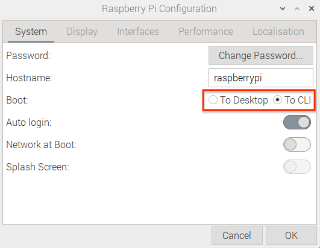

# Raspberry Pi Setting
<hr/>

### Raspberry Pi setting strategy
[1. SSH setting](#ssh-setting)

[2. Mirror setting](#mirror-setting)

[3. Remove unnecessary packages](#remove-package)

[4. Install necessary packages](#install-package)

[5. Python Environment](#python-environment)

[6. Text Mode](#text-mode)

[7. Screen Saver Off](#screen-saver-off)

[8. Supervisor](#supervisor)

[9. SSH Tunnel Supervisor](#ssh-tunnel-supervisor)

<hr/>

## SSH setting

* Go to Preferences &rarr; Raspberry Pi Configuration &rarr; Interfaces

</img>

* Copy SSH public key (`cup_desk_id_rsa`, `cup_desk_id_ras.pub`)
* SSH config setting (After [3_VM](./3_VM.md) setting)
	* `cd ~/.ssh; touch config`

	```
	Host ymmon
     Hostname ymmonitor.koreacentral.cloudapp.azure.com
     User cupadmin
     Port 22
     IdentityFile ~/.ssh/cup_desk_id_rsa
	```
	
* Reverse port-forwarding (will replaced by [9. SSH Tunnel Supervisor](#ssh-tunnel-supervisor))
	* `ssh -fN -r 12345:localhost:22 ymmon`
	* From `ymmon` : `ssh -p 12345 webcam1@localhost`
	
## Mirror setting

* Modify fastest mirror
	* `sudo nano /etc/apt/sources.list`
		* `deb http://ftp.kaist.ac.kr/raspbian/raspbian bullseye main contrib non-free rpi`

## Remove Package

* Remove unnecessary packages due to limited disk size

	* `sudo apt purge wolfram-engine`
	* `sudo apt purge libreoffice*`
	* `sudo apt clean`
	* `sudo apt autoremove`

## Install Package
### Webcam

* Install python and webcam related libraries

	* `sudo apt update && sudo apt upgrade`
	* `sudo apt install build-essential cmake pkg-config`
	* `sudo apt install libjpeg-dev libtiff5-dev libjasper-dev libpng-dev`
	* `sudo apt install libavcodec-dev libavformat-dev libswscale-dev libv4l-dev`
	* `sudo apt install libxvidcore-dev libx264-dev`
	* `sudo apt install libfontconfig1-dev libcairo2-dev`
	* `sudo apt install libgdk-pixbuf2.0-dev libpango1.0-dev`
	* `sudo apt install libgtk2.0-dev libgtk-3-dev`
	* `sudo apt install libatlas-base-dev gfortran`
	* `sudo apt install libhdf5-dev libhdf5-serial-dev libhdf5-103`
	* `sudo apt install python3-dev`

## Python Environment

* Install pip
	* `wget https://bootstrap.pypa.io/get-pip.py`
	* `sudo python3 get-pip.py`
	* `sudo rm -rf ~/.cache/pip`
	* `pip install virtualenv`

	* (Option) Install emacs
		* `sudo apt install emacs`

* Working directory : `/opt/monitor`
	* `cd /opt; sudo mkdir monitor; sudo chown webcam1:webcam1 monitor; cd monitor`

* Python virtual evnironment
	* `python3 -m venv venv`
	* `source venv/bin/activate`
	* `pip install numpy`
	* `pip install picamera[array]`
	* `pip install imutils`
	* `pip isntall opencv-python`
	* `pip install opencv-contrib-python` (skip(?) It takes very long time)

## Text Mode

* Go to Preferences &rarr; Raspberry Pi Configuration &rarr; System

</img>

## Screen Saver Off

* `sudo nano /etc/lightdm/lightdm.conf`
	* modify 
		* `#xserver-command=X` &rarr;
		* `xserver-command=X -s 0 -dpms -nocursor`
		* `sudo /etc/init.d/lightdm restart`

## Supervisor
* Install supervisor
	* `sudo apt install supervisor`
	* modify `/etc/supervisor/supervisor.conf`
		* [supervisord] logfile : location &rarr; /opt/monitor/log
		* [supervisord] childlogdir : location &rarr; /opt/monitor/log		* [include] files : location &rarr; /opt/monitor/supervisor

* First stage :
	* `cd /opt/monitor; mkdir log out script supervisor`

* Shell script : `/opt/monitor/script/start.sh`

```
#!/bin/bash
sleep 60
sudo supervisorctl start ssh_tunnel
sudo supervisorctl start run_cam
```
	
* Web-cam Supervisor script : `webcam.conf`

```
[program:run_cam]
command = /opt/monitor/script/webcam.py
directory = /opt/monitor/
process_name = %(program_name)s
autostart = false
autorestart = true
user = webcam1
redirect_stderr=true
stdout_logfile = /opt/monitor/log/web_cam.out
stderr_logfile = /opt/monitor/log/web_cam.err
```

* Web-cam python script : `webcam.py` with executable file

```
#!/opt/monitor/venv/bin/python

from datetime import datetime
import time
import cv2
import numpy as np
import sys
import logging
import os

logging.basicConfig(stream=sys.stdout, format='%(asctime)s %(levelname)-8s %(message)s', level=logging.INFO)

minutes=1
wait=minutes*60

def main():
	while True:
		try:
			cap = cv2.VideoCapture(0)
			cap.set(cv2.CAP_PROP_FOURCC, cv2.VideoWriter_fourcc('M','J','P','G'))
			cap.set(cv2.CAP_PROP_FRAME_WIDTH,  1920)
			cap.set(cv2.CAP_PROP_FRAME_HEIGHT, 1080)
			ret, image = cap.read()
			hsv = cv2.cvtColor(image, cv2.COLOR_BGR2HSV)
			now = datetime.now()
			current_time = now.strftime("%H%M")

			cv2.imwrite("/opt/monitor/out/webcam.png", image)
			logging.info("Save webcam.png : ".format(current_time))
			os.popen("scp /opt/monitor/out/webcam.png ymmon:/data/www/html/webcam/")
			time.sleep(wait)
			cap.release()
		except KeyboardInterrupt:
			logging.info('Good bye')
			break
		except:
			logging.exception('Exception')
			time.sleep(wait)

if __name__ == '__main__':
	main()
```

* Run supervisor
	* `sudo systemctl start supervisor`
	* `sudo systemctl enable supervisor`

## SSH-Tunnel supervisor

* Supervisor script : `/opt/monitor/supervisor/ssh.conf`
	
```
[program:startup]
command = /opt/monitor/script/start.sh
startsecs = 0
autostart = true
autorestart = false
startretries = 1
priority = 1
stdout_logfile = /opt/monitor/log/startup.out
stderr_logfile = /opt/monitor/log/startup.err

[program:ssh_tunnel]
command = ssh -i /home/webcam1/.ssh/cup_desk_id_rsa -R 12345:localhost:22 cupadmin@ymmonitor.koreacentral.cloudapp.azure.com
process_name = %(program_name)s
autostart = false
autorestart = true
erxitgcodes=0
user = webcam1
stopsignal=KILL
stdout_logfile = /opt/monitor/log/ssh_tunnel.out
stderr_logfile = /opt/monitor/log/ssh_tunnel.err
```

* Update new process to supervisor ctl
	* `sudo supervisorctl update`
	* `sudo supervisroctl start startup`