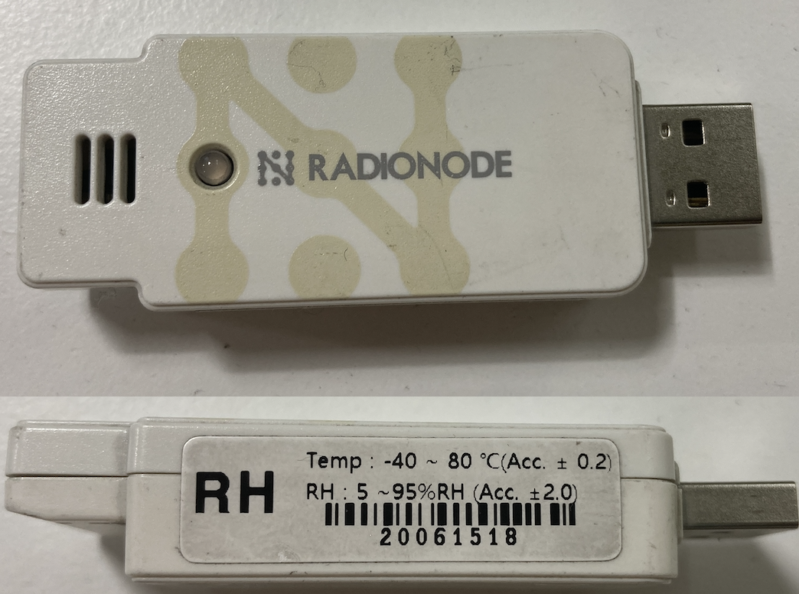

# Raspberry Pi Setting
<hr/>

### Raspberry Pi setting strategy
[1. Python Environment](#python-environment)

[2. Monitor Temperature & Humidity](#monitor-temperature-and-humidity)

[3. Supervisor](#supervisor)

<hr/>

## Python Environment

* Working directory : `cd /opt/monitor`
	* `mkdir data`

* Python virtual evnironment
	* `python3 -m venv venv`
	* `source venv/bin/activate`
	* `pip install pathlib`
	* `pip install pyserial`
	
## Monitor Temperature and Humidity

* UA10 module
	* Serial : `20061518`
	
</img>

## Supervisor

* modify `start.sh` [1 RaspberryPi webcam](./1_RaspberryPi_webcam.md)
* UA10 Supervisor script : `UA10.conf`

```
[program:run_UA10]
command = /opt/monitor/script/UA10.py
directory = /opt/monitor/
process_name = %(program_name)s
autostart = false
autorestart = true
user = webcam1
redirect_stderr = true
stdout_logfile = /opt/monitor/log/UA10.out
stderr_logfile = /opt/monitor/log/UA10.err
```

* UA10 python script : `UA10.py` with executable file

```
#!/opt/monitor/venv/bin/python                                                                                                               

import sys
import time
import logging
from pathlib import Path
import json
import serial
import os

logging.basicConfig(stream=sys.stdout, format="%(asctime)s %(levelname)-8s %(message)s", level=logging.DEBUG)

SLOWDIR = '/opt/monitor/'

DEVS=[
	{
		'sn': '20061518',
		'model': 'UA10',
		'dev': '/dev/serial/by-id/usb-Dekist_Co.__Ltd._UA_SERIES__20061518-if00',
		},
]

def read(devinfo):
	datapoint = {}
	with serial.Serial(devinfo['dev'], 19200, timeout=5) as ser:
		ser.write(b'ATCD\r\n')
		line = ser.readline()   # read a '\n' terminated line                                                                                

	line = line.decode('utf-8').strip()
	logging.debug(f'RESPONSE: {line}')
	cmd, result = line.split(' ')
	if devinfo['model'] == 'UA10':
		temp, hum = result.split(',')
		datapoint = {
			'measurement': 'temphum',
			'sn': devinfo['sn'],
			'model': devinfo['model'],
			'time': int(time.time()),
			'temp': float(temp),
			'hum': float(hum),
		}
	return datapoint

def main():
	while True:
		data = []
		for devinfo in DEVS:
			try:
				datapoint = read(devinfo)
				data.append(datapoint)
			except:
				logging.exception('Exception: ')

		logging.debug(data)
		try:
			p = Path(SLOWDIR) / 'data' / 'UA10.log'
			with p.open('w') as f:
				for d in data:
					f.write(json.dumps(d)+'\n')

			cmd = f'scp {p} ymmon:/monitor/raw/'
			os.popen(cmd)

			time.sleep(60)
		except KeyboardInterrupt:
			logging.info('Good bye!')
			break
		except:
			logging.exception('Exception: ')
			time.sleep(60)

if __name__ == '__main__':
	main()
```

* Run supervisor
	* `sudo systemctl start supervisor`
	* `sudo systemctl enable supervisor`
