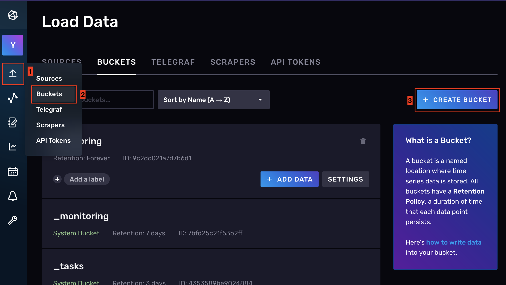
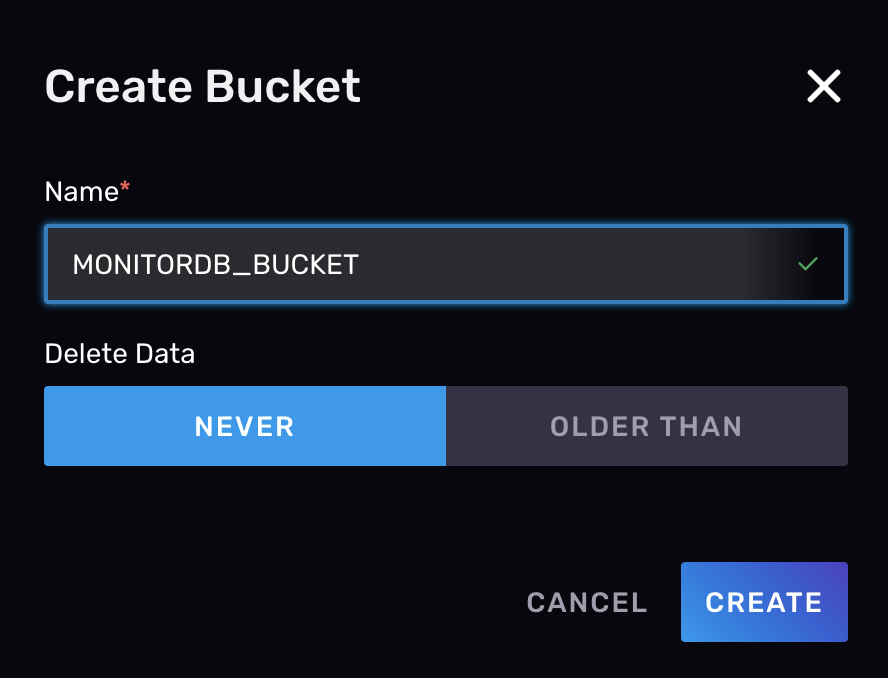
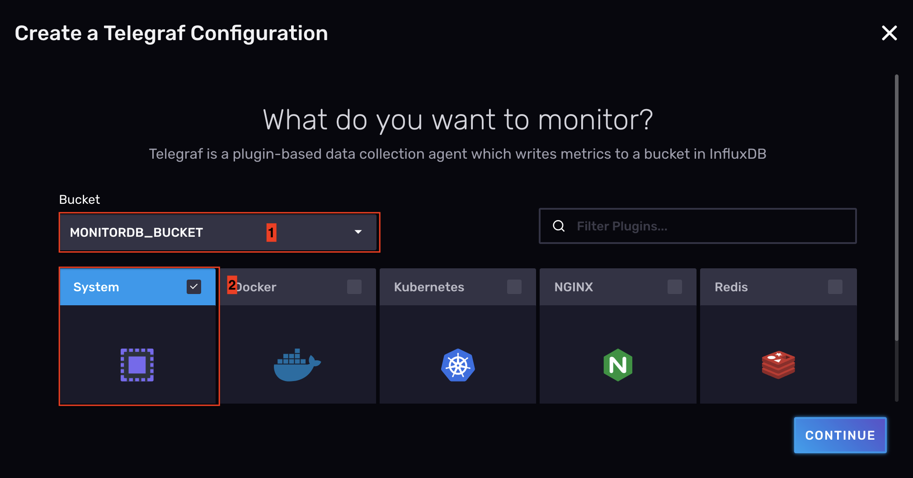
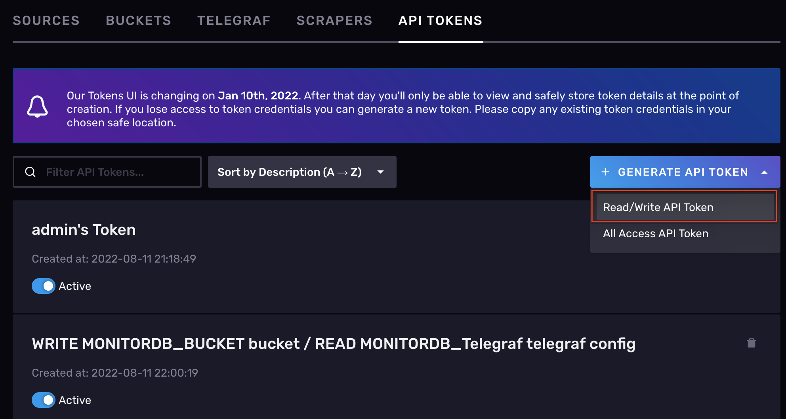
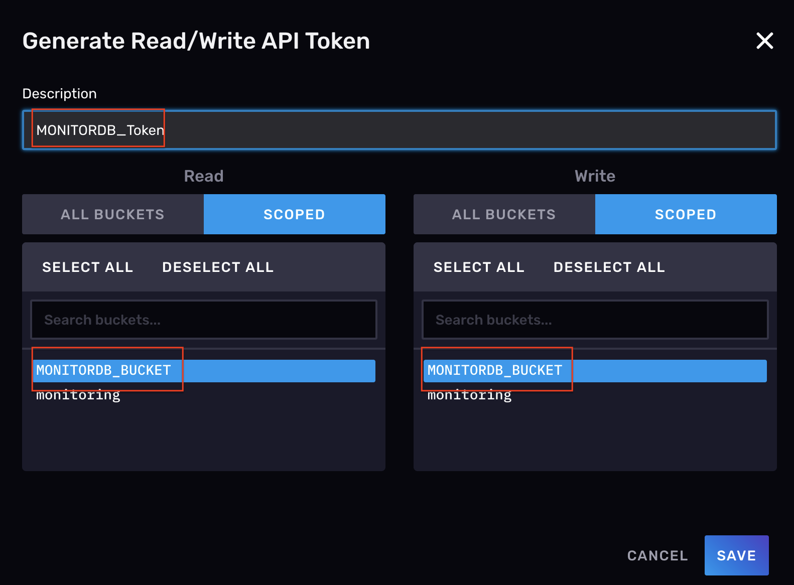
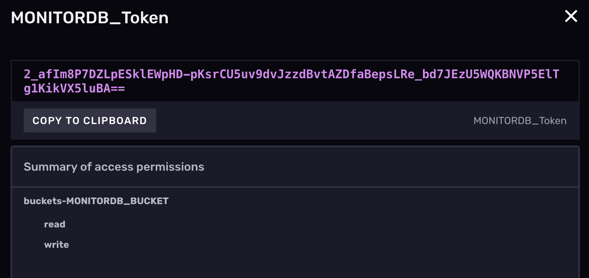
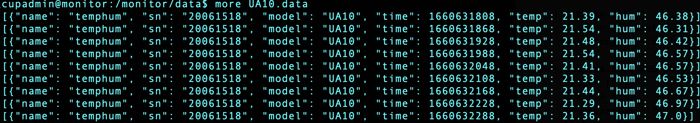
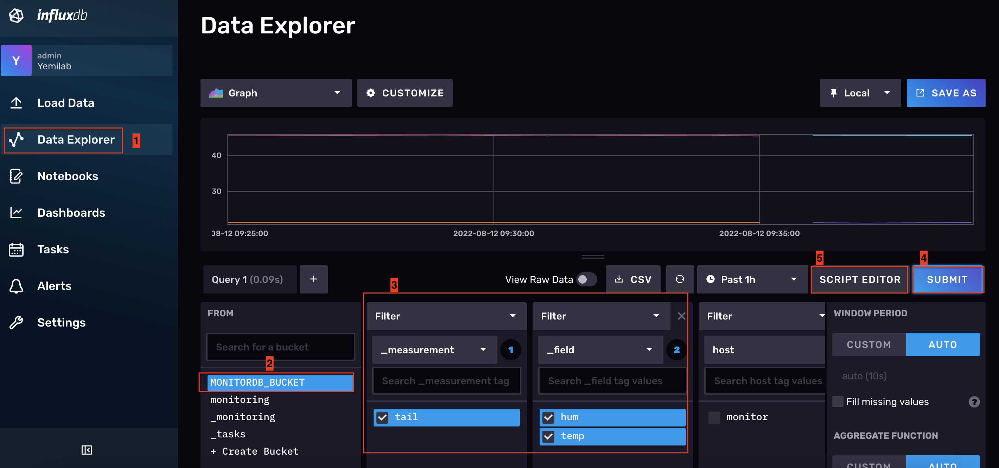
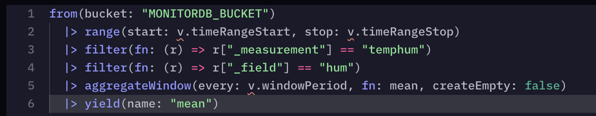

# Telegraf

<hr/>

### DB setting thru Telegraf

* Logged data to InfluxDB : VM server

[1. Environment Setting](#environment-setting)

[2. Data Logging](#data-logging)

[3. InfluxDB](#influxdb)

[4. Telegraf](#telegraf)

[5. Supervisor](#supervisor)

[6. Test](#test)
<hr/>

## Environment Setting

* Prepare DB related directory
	* `cd /monitor; mkdir data raw telegraf`

* Python environment & install necessary package
	* `source /monitor/venv/bin/activate`
	* `pip install pathlib`

## Data Logging

* Log to data : `getUA10.py` with executable file to `/monitor/script`
	
```
#!/monitor/venv/bin/python

import sys
import logging
from pathlib import Path
import time
import json

logging.basicConfig(stream=sys.stdout, format="%(asctime)s %(levelname)-8s %(message)s", level=logging.DEBUG)

LOGFILE = '/monitor/raw'
OUTFILE = '/monitor/data'

def read(logfile):
	data = []
	with logfile.open('r') as f:
		data = json.load(f)

	return data

def write(indata):
	data  = indata
	name  = indata['measurement']
	sn    = indata['sn']
	model = indata['model']
	time  = indata['time']
	temp  = indata['temp']
	hum   = indata['hum']

	raw = [{
	"name"  : name,
	"sn"    : sn,
	"model" : model,
	"time"  : time,
	"temp"  : temp,
	"hum"   : hum,
	}]
	return raw


def main():
		while True:
		data = []
		logfile = Path(LOGFILE) / 'UA10.log'
		data = read(logfile)

		raw = []
		raw = write(data)
		logging.debug(data)

		try:
			p = Path(OUTFILE) / 'UA10.data'
			with p.open('a') as f:
				f.write(json.dumps(raw)+'\n')

			time.sleep(60)
		except KeyboardInterrupt:
			logging.info('Good bye!')
			break

		except:
			logging.exception('Exception: ')
			time.sleep(60)

if __name__ == "__main__":
	main()
```

* Supervisor script : `UA10.conf` 

```
[program:run_UA10]
command = /monitor/script/getUA10.py
process_name = %(program_name)s
autostart = true
autorestart = unexpected
user = cupadmin
redirect_stderr = true
stdout_logfile = /monitor/log/run_UA10.out
stderr_logfile = /monitor/log/run_UA10.err

```

## InfluxDB

* Open web-browser and go `https://influxdb.monitor.yemilab.kr` and login

### Create Bucket

* Click `Data` in side menu &rarr; `Buckets` in top menu &rarr; `Create Bucket`

</img>

* Create New Bucket (`MONITORDB_BUCKET`)

</img>

### Create Telegraf Configuration

* Click `Telegraf` in top menu &rarr; Create Configuration
* Select `Bucket` and Click `System` &rarr; `Continue`

</img>

* Create a Telegraf Configuration (`MONITORDB_Telegraf`)

### Create API Token

* Click `API Token` in top menu &rarr; `Generate API Token` and Choose `Read/Write API Token`

</img>

* Add Read and Write permission to Bucket what you made (`MONITORDB_BUCKET`) &rarr; Naming as `MONITORDB_Token`

</img>

* Click Token, `MONITORDB_Token` and copy Token Values

</img>

## Telegraf
* Install Telegraf
	* `sudo apt install telegraf`

* Move to Telegraf directory
	* `cd /monitor/telegraf; touch UA10.conf`

* Our data format

</img>

```
[global_tags]

[agent]
  interval = "10s"
  round_interval = true
  metric_batch_size = 1000
  metric_buffer_limit = 10000
  collection_jitter = "0s"
  flush_interval = "10s"
  flush_jitter = "0s"
  precision = ""
  hostname = ""
  omit_hostname = false

[[outputs.influxdb_v2]]				
  urls = [""]
  token = ""
  organization = ""
  bucket = ""
  insecure_skip_verify = true

[[inputs.tail]]
  files = [
    "",
  ]
  from_beginning = false
  pipe = false
  data_format = "json"
  json_strict = true
  json_name_key = "name"
  json_time_key = "time"
  json_time_format = "unix"
  json_timezone = "Asia/Seoul"
```	

* Modify `[[outputs.influxdb_v2]]`
	* `urls = ["https://influxdb.monitor.yemilab.kr"]`
	* `token = ""` what you copied
	*  `organization = "Yemilab"`
	*  `bucket = "MONITORDB_BUCKET"`
	
* Modify `[[inputs.tail]]`
	* `files = ["/monitor/data/UA10.data",]` data location	

## Supervisor

*  Move to Supervisor directory
	* `cd /monitor/supervisor; touch telegraf_UA10.conf`

```
[program:telegraf_UA10]
command = /usr/bin/telegraf --config /monitor/telegraf/UA10.conf
process_name = %(program_name)s
autostart = true
autorestart = unexpected
user = cupadmin
redirect_stderr=true
stdout_logfile = /monitor/log/telegraf_UA10.out
stderr_logfile = /monitor/log/telegraf_UA10.err
```

* Update new process to supervisorctl
	* `sudo supervisorctl update`

## Test
* Click `Data Explore` in side menu &rarr; Select `BUCKET` &rarr; Select Monitoring Variable &rarr; `Submit`

</img>

* Click `Script Editor`

</img>

* This is comfortable code. If we copy and paste to Grafana, we can easily make monitoring plot by Grafana