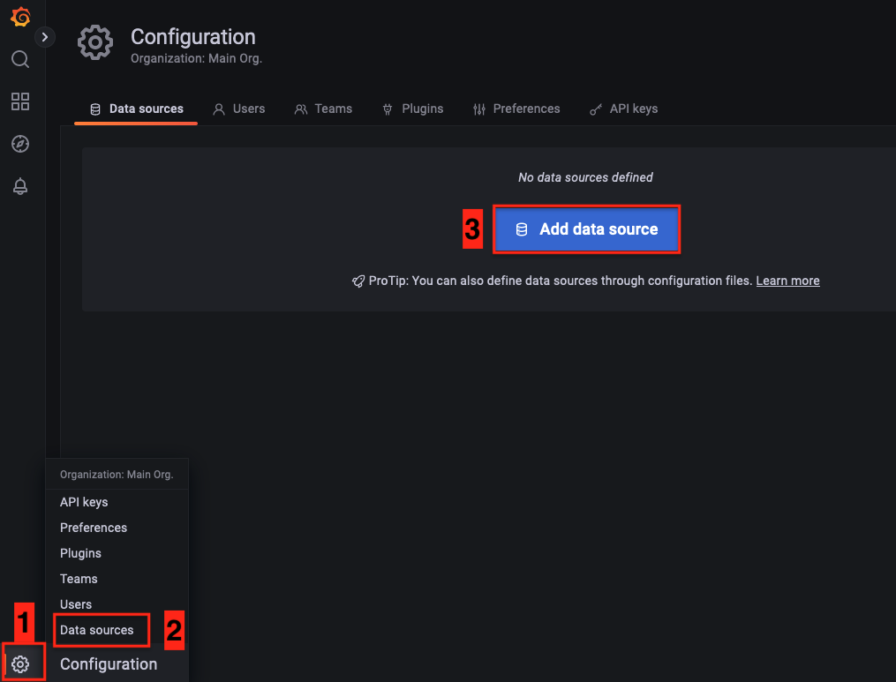
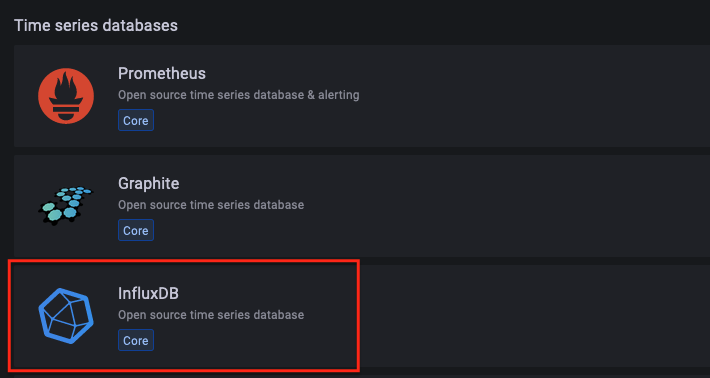
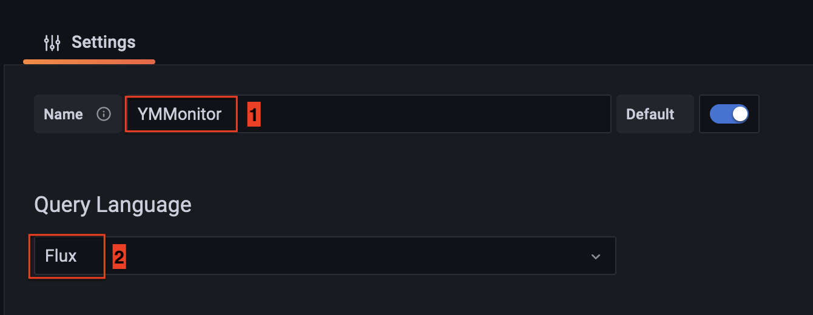
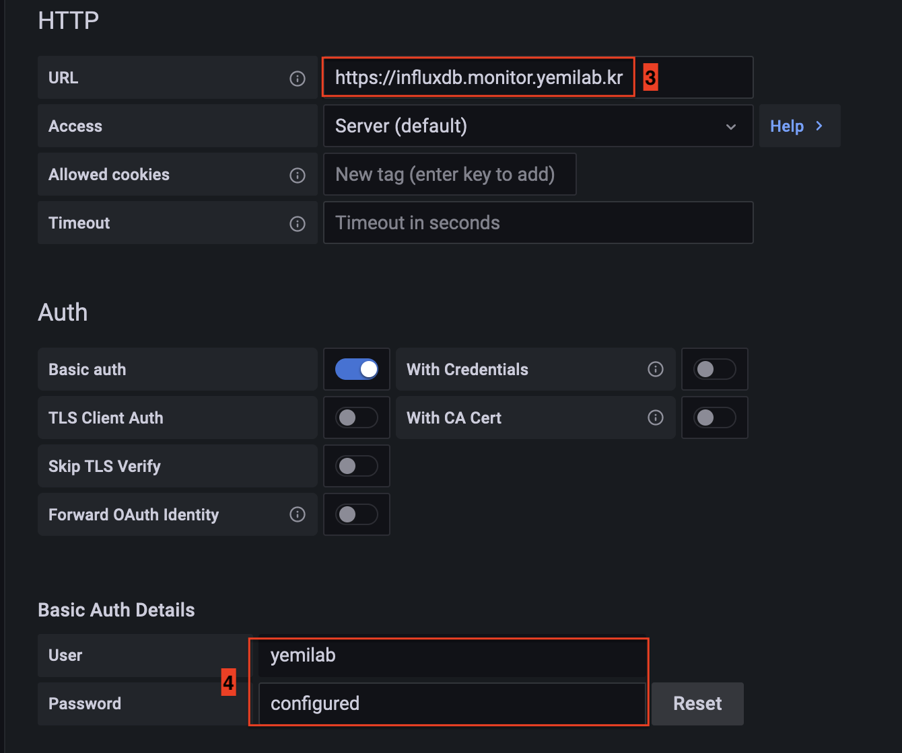
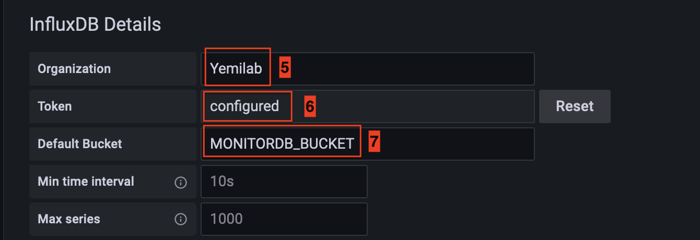
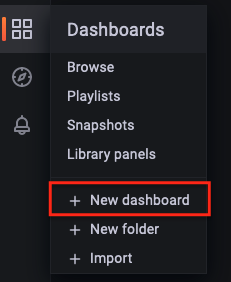
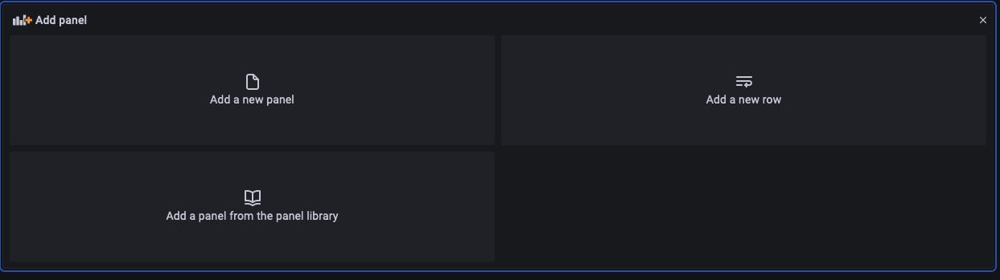

# Grafana

[1. Grafana Setting](#grafana-setting)

[2. Monitoring Setting](#monitoring-setting)

## Grafana Setting

* Open web-browser and go `https://grafana.monitor.yemilab.kr` and login

### Connect InfluxDB to Grafana

* Click `Configuration` &rarr; `Data sources` &rarr; `Add data source`

</img>

* Select `InfluxDB`

</img>

1. Set Name
2. Select `Flux` for InfluxDB2
3. Fill InfluxDB URL : `https://influxdb.monitor.yemilab.kr`
4. Fill Grafana User name
5. Fill Organization
6. Fill telegraf token
7. Fill Bucket
8. Save

</img>

</img>

</img>

## Monitoring Setting

* Click `Dashboards` &rarr; `+ New dashboard`

</img>

* Add an empty panel

</img>

* Past script from [8_Telegraf](./8_telegraf.md)

